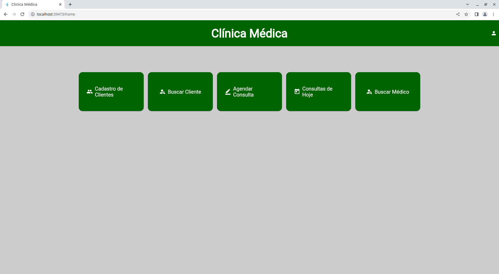
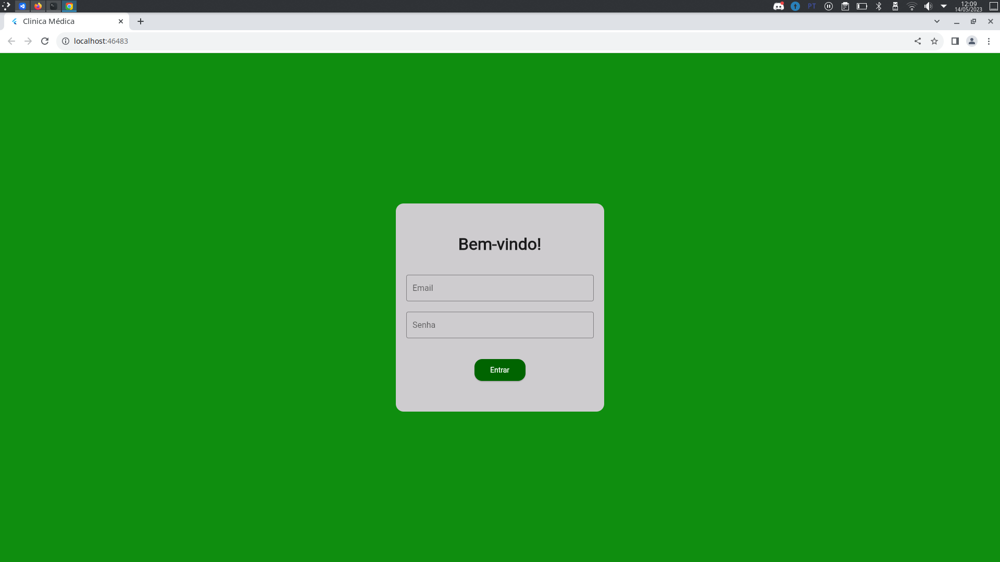
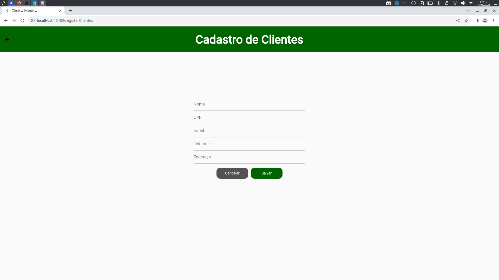
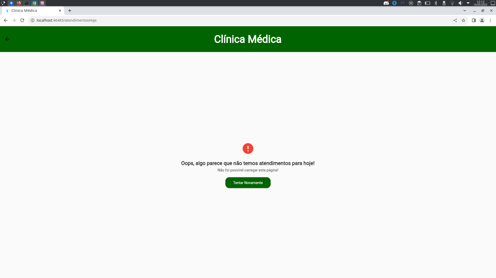

# __Clinica Médica__

A Clinica Médica é uma solução WEB para o gerenciamento de atendimentos em uma clinica. O projeto foi construindo utilizando o banco de dados postgres, FastAPI e Flutter WEB. 

## __Requisitos Necessários__.

  Esta seção consta os requisitos necessários para execução do sistema. Julgando-se necessário que seja instalado de primeira mão o [Python](https://www.python.org/downloads/), o [Postgres](https://www.postgresql.org/) e o [Flutter](https://flutter.dev/).

### __Backend__
  
  Para utilizar o backend da aplicação é necessário a instalar o [FastAPI](https://fastapi.tiangolo.com/pt/) e algumas bibliotecas importantes ao projeto através do [Pip](https://pypi.org/project/pip/), o instador padrão do Python.
  
  
  - FastAPI: 

      ~~~linux
      pip install fastapi
      ~~~
      
  - Uvicorn: 

      ~~~linux
      pip install uvicorn
      ~~~
  
  - sqlalchemy: 

      ~~~linux
      pip install sqlalchemy
      ~~~
        
  - passlib: 

      ~~~linux
      pip install passlib
      ~~~  
  - python-jose: 

      ~~~linux
      pip install python-jose
      ~~~
  - psycopg2: 

      ~~~linux
      pip install psycopg2
      ~~~

## __Execução do sistema__.

### __Backend__

- Executar API: Dentro da pasta do /backend faça:

    ~~~linux
    python3 -m uvicorn src.main:app --reload --host 0.0.0.0
    ~~~

### __Banco de dados__
É válido que você não tenha o banco de dados utilizado nesta aplicação para executar seus teste, então:

- No arquivo *backend/src/infra/sqlalchemy/config/config_db.py* está as configurações do banco de dados. Configure os dados necessários para que ele acesse o seu postgres.

- O arquivo *database/clinica.sql* contem o *backup* do banco de dados já povoado que foi utilizado na construção deste projeto. Voçê pode restaurar o banco seguindo os comandos abaixo:

    - Criando um banco de dados para receber o *backup*.

    ~~~ postgres
    postgres=# CREATE DATABASE clinica TEMPLATE template0;
    ~~~

    - Fazendo o *backup* do banco de dados na cli do Linux.

    ~~~postgres
    sudo -u postgres psql clinica < clinica.sql
    ~~~

### __Frontend__

Edite o arquivo *api.dart* que está em */lib/api/api.dart*

- Coloque o IP da máquina que está executando a API na variável __myIP__.

    ~~~linux
    myIP = 'Coloque o IP da API':8000
    ~~~

## __Screenshots__

Esta seção reserva-se aos screenshots de algumas telas do sistema.

